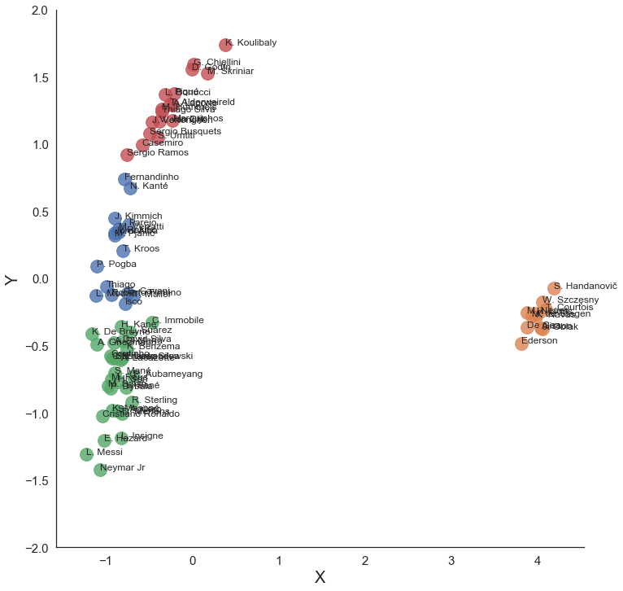
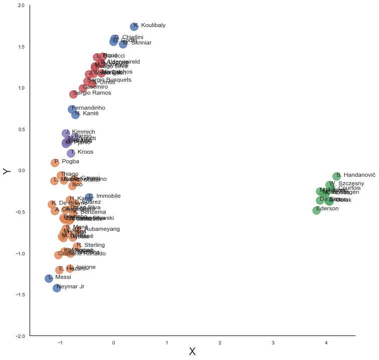

# Introduction

FIFA is a soccer simulation video games developed by Electronic Arts and it is the most popular sports video game franchise in the world. The game is released annually and has had a long history of development dated back to the 1990s.

#### Dataset: https://www.kaggle.com/stefanoleone992/fifa-20-complete-player-dataset

# Exploring the Dataset

#### Top 15 Youngest Players

<table border="1" class="dataframe">
  <thead>
    <tr style="text-align: right;">
      <th></th>
      <th>Name</th>
      <th>Age</th>
      <th>Club</th>
      <th>Nationality</th>
    </tr>
  </thead>
  <tbody>
    <tr>
      <td>18171</td>
      <td>J. Starbuck</td>
      <td>16</td>
      <td>Grimsby Town</td>
      <td>England</td>
    </tr>
    <tr>
      <td>4764</td>
      <td>A. Hložek</td>
      <td>16</td>
      <td>Sparta Praha</td>
      <td>Czech Republic</td>
    </tr>
    <tr>
      <td>18243</td>
      <td>E. Sartorius</td>
      <td>16</td>
      <td>Lincoln City</td>
      <td>England</td>
    </tr>
    <tr>
      <td>17827</td>
      <td>D. Burns</td>
      <td>16</td>
      <td>St. Patrick's Athletic</td>
      <td>Northern Ireland</td>
    </tr>
    <tr>
      <td>17614</td>
      <td>D. Obbekjær</td>
      <td>16</td>
      <td>Odense Boldklub</td>
      <td>Denmark</td>
    </tr>
    <tr>
      <td>17782</td>
      <td>S. Anderson</td>
      <td>16</td>
      <td>Colorado Rapids</td>
      <td>United States</td>
    </tr>
    <tr>
      <td>18242</td>
      <td>R. Wikberg</td>
      <td>16</td>
      <td>Östersunds FK</td>
      <td>Sweden</td>
    </tr>
    <tr>
      <td>18031</td>
      <td>O. Stefánsson</td>
      <td>16</td>
      <td>IFK Norrköping</td>
      <td>Iceland</td>
    </tr>
    <tr>
      <td>14626</td>
      <td>A. Velasco</td>
      <td>16</td>
      <td>Independiente</td>
      <td>Argentina</td>
    </tr>
    <tr>
      <td>12160</td>
      <td>S. Esposito</td>
      <td>16</td>
      <td>Inter</td>
      <td>Italy</td>
    </tr>
    <tr>
      <td>12158</td>
      <td>E. Millot</td>
      <td>16</td>
      <td>AS Monaco</td>
      <td>France</td>
    </tr>
    <tr>
      <td>6630</td>
      <td>Fábio Silva</td>
      <td>16</td>
      <td>FC Porto</td>
      <td>Portugal</td>
    </tr>
    <tr>
      <td>13979</td>
      <td>N. Wood</td>
      <td>17</td>
      <td>Middlesbrough</td>
      <td>England</td>
    </tr>
    <tr>
      <td>13981</td>
      <td>M. Olise</td>
      <td>17</td>
      <td>Reading</td>
      <td>France</td>
    </tr>
    <tr>
      <td>13987</td>
      <td>F. Tolomello</td>
      <td>17</td>
      <td>Trapani</td>
      <td>Italy</td>
    </tr>
  </tbody>
</table>

#### Top 15 Oldest Players

<table border="1" class="dataframe">
  <thead>
    <tr style="text-align: right;">
      <th></th>
      <th>Name</th>
      <th>Age</th>
      <th>Club</th>
      <th>Nationality</th>
    </tr>
  </thead>
  <tbody>
    <tr>
      <td>13003</td>
      <td>H. Sulaimani</td>
      <td>42</td>
      <td>Al Ahli</td>
      <td>Saudi Arabia</td>
    </tr>
    <tr>
      <td>11832</td>
      <td>C. Muñoz</td>
      <td>42</td>
      <td>CD Universidad de Concepción</td>
      <td>Argentina</td>
    </tr>
    <tr>
      <td>200</td>
      <td>G. Buffon</td>
      <td>41</td>
      <td>Juventus</td>
      <td>Italy</td>
    </tr>
    <tr>
      <td>3706</td>
      <td>C. Lucchetti</td>
      <td>41</td>
      <td>Atlético Tucumán</td>
      <td>Argentina</td>
    </tr>
    <tr>
      <td>10665</td>
      <td>F. Kippe</td>
      <td>41</td>
      <td>Lillestrøm SK</td>
      <td>Norway</td>
    </tr>
    <tr>
      <td>868</td>
      <td>Hilton</td>
      <td>41</td>
      <td>Montpellier HSC</td>
      <td>Brazil</td>
    </tr>
    <tr>
      <td>2965</td>
      <td>Cifuentes</td>
      <td>40</td>
      <td>Cádiz CF</td>
      <td>Spain</td>
    </tr>
    <tr>
      <td>15812</td>
      <td>M. Gurski</td>
      <td>40</td>
      <td>SpVgg Unterhaching</td>
      <td>Germany</td>
    </tr>
    <tr>
      <td>8359</td>
      <td>F. Cubero</td>
      <td>40</td>
      <td>Vélez Sarsfield</td>
      <td>Argentina</td>
    </tr>
    <tr>
      <td>2963</td>
      <td>D. Dainelli</td>
      <td>40</td>
      <td>Livorno</td>
      <td>Italy</td>
    </tr>
    <tr>
      <td>14527</td>
      <td>D. Bulman</td>
      <td>40</td>
      <td>Crawley Town</td>
      <td>England</td>
    </tr>
    <tr>
      <td>6235</td>
      <td>J. Gillet</td>
      <td>40</td>
      <td>Standard de Liège</td>
      <td>Belgium</td>
    </tr>
    <tr>
      <td>10702</td>
      <td>M. Caranta</td>
      <td>40</td>
      <td>Club Atlético Talleres</td>
      <td>Argentina</td>
    </tr>
    <tr>
      <td>7230</td>
      <td>Lee Dong Gook</td>
      <td>40</td>
      <td>Jeonbuk Hyundai Motors</td>
      <td>Korea Republic</td>
    </tr>
    <tr>
      <td>1880</td>
      <td>C. Pizarro</td>
      <td>40</td>
      <td>SV Werder Bremen</td>
      <td>Peru</td>
    </tr>
  </tbody>
</table>

#### Top 10 Left-footed Players

<table border="1" class="dataframe">
  <thead>
    <tr style="text-align: right;">
      <th></th>
      <th>Name</th>
      <th>Age</th>
      <th>Overall</th>
      <th>Club</th>
      <th>Nationality</th>
    </tr>
  </thead>
  <tbody>
    <tr>
      <td>0</td>
      <td>L. Messi</td>
      <td>32</td>
      <td>94</td>
      <td>FC Barcelona</td>
      <td>Argentina</td>
    </tr>
    <tr>
      <td>9</td>
      <td>M. Salah</td>
      <td>27</td>
      <td>90</td>
      <td>Liverpool</td>
      <td>Egypt</td>
    </tr>
    <tr>
      <td>16</td>
      <td>G. Chiellini</td>
      <td>34</td>
      <td>89</td>
      <td>Juventus</td>
      <td>Italy</td>
    </tr>
    <tr>
      <td>22</td>
      <td>A. Griezmann</td>
      <td>28</td>
      <td>89</td>
      <td>FC Barcelona</td>
      <td>France</td>
    </tr>
    <tr>
      <td>23</td>
      <td>P. Dybala</td>
      <td>25</td>
      <td>88</td>
      <td>Juventus</td>
      <td>Argentina</td>
    </tr>
    <tr>
      <td>25</td>
      <td>Ederson</td>
      <td>25</td>
      <td>88</td>
      <td>Manchester City</td>
      <td>Brazil</td>
    </tr>
    <tr>
      <td>28</td>
      <td>T. Courtois</td>
      <td>27</td>
      <td>88</td>
      <td>Real Madrid</td>
      <td>Belgium</td>
    </tr>
    <tr>
      <td>32</td>
      <td>H. Lloris</td>
      <td>32</td>
      <td>88</td>
      <td>Tottenham Hotspur</td>
      <td>France</td>
    </tr>
    <tr>
      <td>33</td>
      <td>David Silva</td>
      <td>33</td>
      <td>88</td>
      <td>Manchester City</td>
      <td>Spain</td>
    </tr>
    <tr>
      <td>40</td>
      <td>A. Laporte</td>
      <td>25</td>
      <td>87</td>
      <td>Manchester City</td>
      <td>France</td>
    </tr>
  </tbody>
</table>

#### Top 10 Right-footed Players

<table border="1" class="dataframe">
  <thead>
    <tr style="text-align: right;">
      <th></th>
      <th>Name</th>
      <th>Age</th>
      <th>Overall</th>
      <th>Club</th>
      <th>Nationality</th>
    </tr>
  </thead>
  <tbody>
    <tr>
      <td>1</td>
      <td>Cristiano Ronaldo</td>
      <td>34</td>
      <td>93</td>
      <td>Juventus</td>
      <td>Portugal</td>
    </tr>
    <tr>
      <td>2</td>
      <td>Neymar Jr</td>
      <td>27</td>
      <td>92</td>
      <td>Paris Saint-Germain</td>
      <td>Brazil</td>
    </tr>
    <tr>
      <td>3</td>
      <td>J. Oblak</td>
      <td>26</td>
      <td>91</td>
      <td>Atlético Madrid</td>
      <td>Slovenia</td>
    </tr>
    <tr>
      <td>4</td>
      <td>E. Hazard</td>
      <td>28</td>
      <td>91</td>
      <td>Real Madrid</td>
      <td>Belgium</td>
    </tr>
    <tr>
      <td>5</td>
      <td>K. De Bruyne</td>
      <td>28</td>
      <td>91</td>
      <td>Manchester City</td>
      <td>Belgium</td>
    </tr>
    <tr>
      <td>6</td>
      <td>M. ter Stegen</td>
      <td>27</td>
      <td>90</td>
      <td>FC Barcelona</td>
      <td>Germany</td>
    </tr>
    <tr>
      <td>7</td>
      <td>V. van Dijk</td>
      <td>27</td>
      <td>90</td>
      <td>Liverpool</td>
      <td>Netherlands</td>
    </tr>
    <tr>
      <td>8</td>
      <td>L. Modrić</td>
      <td>33</td>
      <td>90</td>
      <td>Real Madrid</td>
      <td>Croatia</td>
    </tr>
    <tr>
      <td>10</td>
      <td>K. Mbappé</td>
      <td>20</td>
      <td>89</td>
      <td>Paris Saint-Germain</td>
      <td>France</td>
    </tr>
    <tr>
      <td>11</td>
      <td>K. Koulibaly</td>
      <td>28</td>
      <td>89</td>
      <td>Napoli</td>
      <td>Senegal</td>
    </tr>
  </tbody>
</table>

#### Top 10 players with highest earnings

<table border="1" class="dataframe">
  <thead>
    <tr style="text-align: right;">
      <th></th>
      <th>Name</th>
      <th>Wage (Euro)</th>
      <th>Age</th>
      <th>Club</th>
      <th>Nationality</th>
    </tr>
  </thead>
  <tbody>
    <tr>
      <td>0</td>
      <td>L. Messi</td>
      <td>565000</td>
      <td>32</td>
      <td>FC Barcelona</td>
      <td>Argentina</td>
    </tr>
    <tr>
      <td>4</td>
      <td>E. Hazard</td>
      <td>470000</td>
      <td>28</td>
      <td>Real Madrid</td>
      <td>Belgium</td>
    </tr>
    <tr>
      <td>1</td>
      <td>Cristiano Ronaldo</td>
      <td>405000</td>
      <td>34</td>
      <td>Juventus</td>
      <td>Portugal</td>
    </tr>
    <tr>
      <td>5</td>
      <td>K. De Bruyne</td>
      <td>370000</td>
      <td>28</td>
      <td>Manchester City</td>
      <td>Belgium</td>
    </tr>
    <tr>
      <td>22</td>
      <td>A. Griezmann</td>
      <td>370000</td>
      <td>28</td>
      <td>FC Barcelona</td>
      <td>France</td>
    </tr>
    <tr>
      <td>19</td>
      <td>L. Suárez</td>
      <td>355000</td>
      <td>32</td>
      <td>FC Barcelona</td>
      <td>Uruguay</td>
    </tr>
    <tr>
      <td>8</td>
      <td>L. Modrić</td>
      <td>340000</td>
      <td>33</td>
      <td>Real Madrid</td>
      <td>Croatia</td>
    </tr>
    <tr>
      <td>36</td>
      <td>T. Kroos</td>
      <td>330000</td>
      <td>29</td>
      <td>Real Madrid</td>
      <td>Germany</td>
    </tr>
    <tr>
      <td>17</td>
      <td>S. Agüero</td>
      <td>300000</td>
      <td>31</td>
      <td>Manchester City</td>
      <td>Argentina</td>
    </tr>
    <tr>
      <td>21</td>
      <td>Sergio Busquets</td>
      <td>300000</td>
      <td>30</td>
      <td>FC Barcelona</td>
      <td>Spain</td>
    </tr>
    <tr>
      <td>18</td>
      <td>Sergio Ramos</td>
      <td>300000</td>
      <td>33</td>
      <td>Real Madrid</td>
      <td>Spain</td>
    </tr>
    <tr>
      <td>2</td>
      <td>Neymar Jr</td>
      <td>290000</td>
      <td>27</td>
      <td>Paris Saint-Germain</td>
      <td>Brazil</td>
    </tr>
    <tr>
      <td>46</td>
      <td>K. Benzema</td>
      <td>285000</td>
      <td>31</td>
      <td>Real Madrid</td>
      <td>France</td>
    </tr>
    <tr>
      <td>29</td>
      <td>Piqué</td>
      <td>285000</td>
      <td>32</td>
      <td>FC Barcelona</td>
      <td>Spain</td>
    </tr>
    <tr>
      <td>33</td>
      <td>David Silva</td>
      <td>265000</td>
      <td>33</td>
      <td>Manchester City</td>
      <td>Spain</td>
    </tr>
  </tbody>
</table>

# Clustering

For this project, I will be using K-Means, DBSCAN, and Hierarchical method to group FIFA 20 top players (overall>85) by their specific attributes.

## Methods:

1. [K-Means](https://github.com/npvlong/Fifa_Clustering/blob/master/ipynb/Clustering%20-%20KMeans.ipynb)

2. [DBSCAN](https://github.com/npvlong/Fifa_Clustering/blob/master/ipynb/Clustering%20-%20DBSCAN.ipynb)

3. [Hierarchical](https://github.com/npvlong/Fifa_Clustering/blob/master/ipynb/Clustering%20-%20Hierarchical.ipynb)

