# Introduction

FIFA is a soccer simulation video games developed by Electronic Arts and it is the most popular sports video game franchise in the world. The game is released annually and has had a long history of development dated back to the 1990s.

# Exploring the Dataset
[Link to the file](https://github.com/npvlong/Fifa_Clustering/blob/master/ipynb/EDA.ipynb)

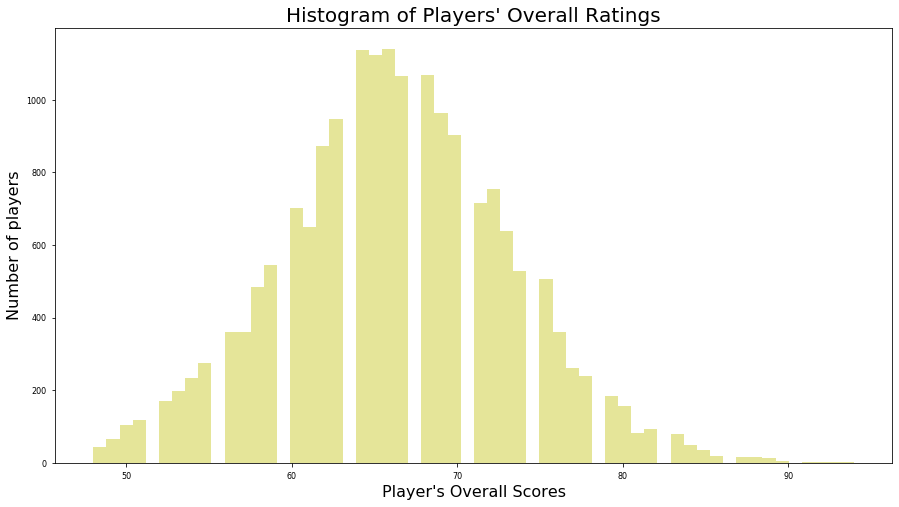

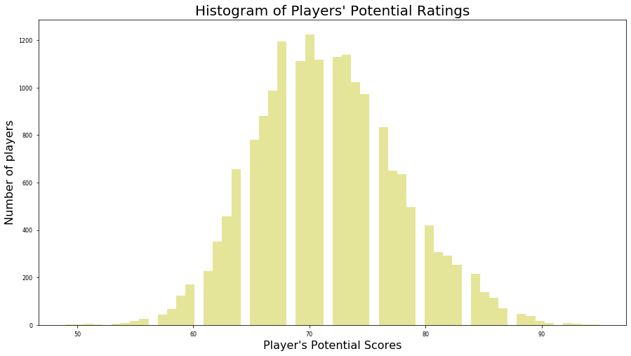

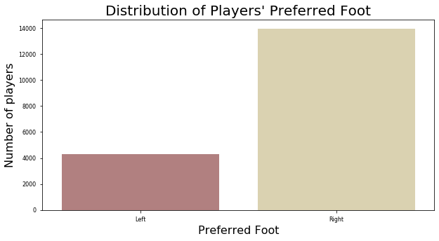

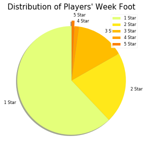

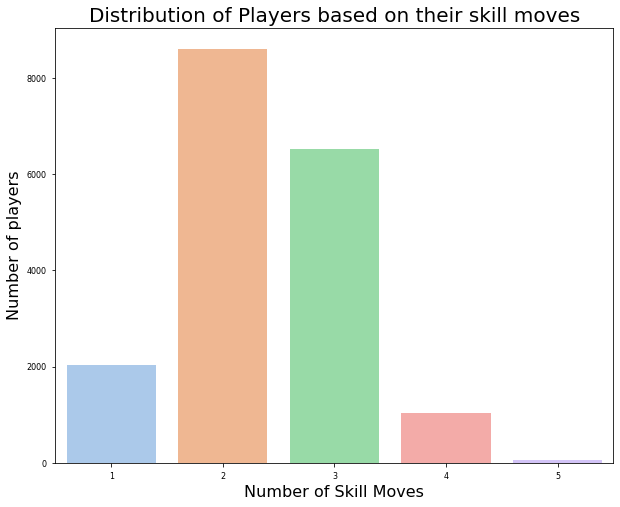

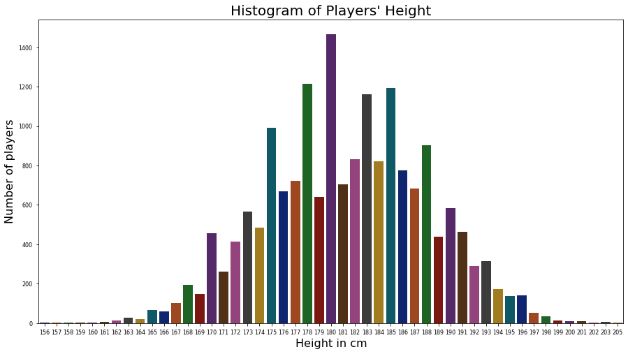

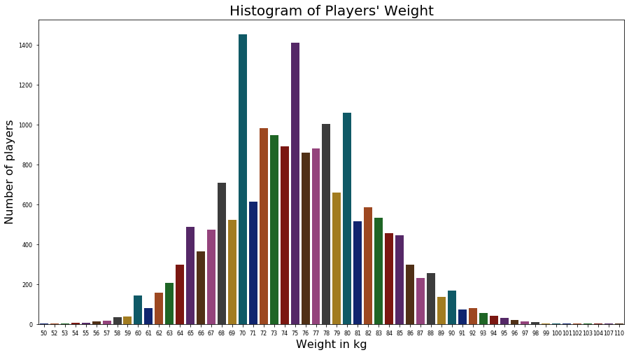

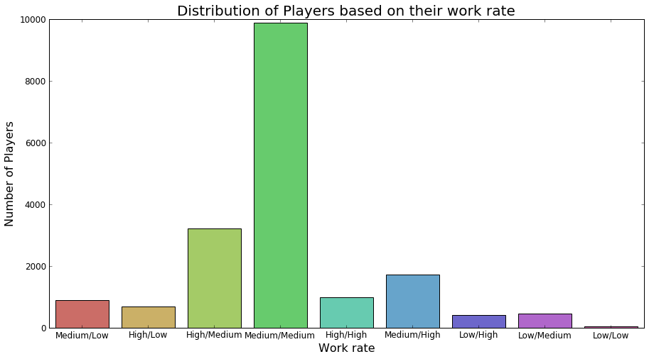

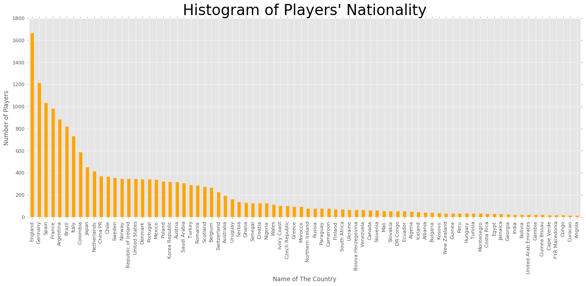

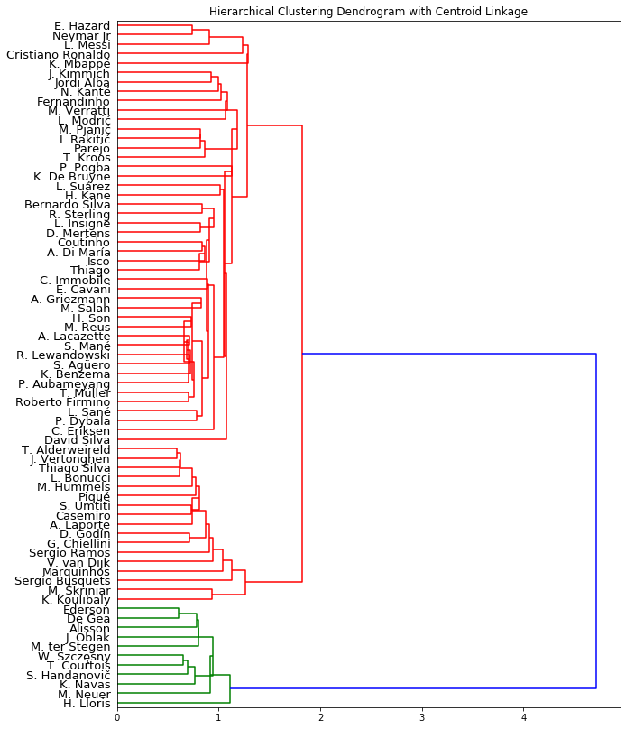

# Clustering

For this project, I will be using clustering methods to group FIFA 20 top players (overall>85) by their specific attributes

## Methods used:

1. [K-Means](https://github.com/npvlong/Fifa_Clustering/blob/master/ipynb/Clustering%20-%20KMeans.ipynb)

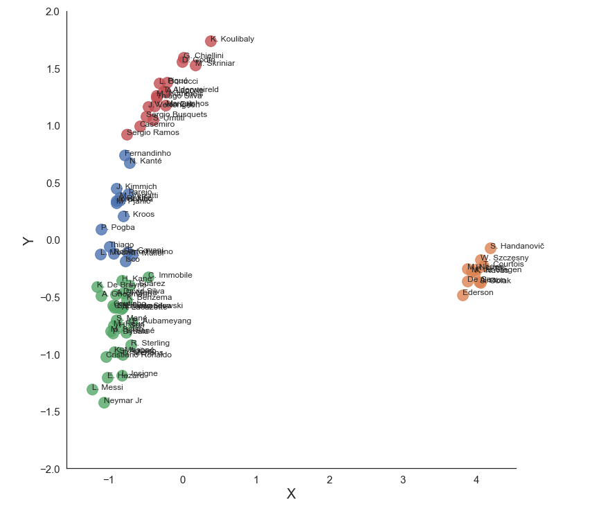

2. [DBSCAN](https://github.com/npvlong/Fifa_Clustering/blob/master/ipynb/Clustering%20-%20DBSCAN.ipynb)

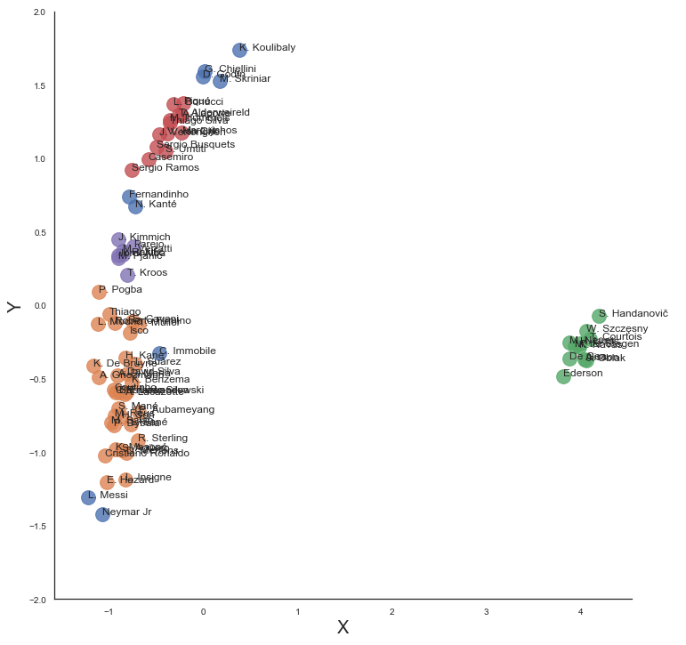

3. [Hierarchical](https://github.com/npvlong/Fifa_Clustering/blob/master/ipynb/Clustering%20-%20Hierarchical.ipynb)

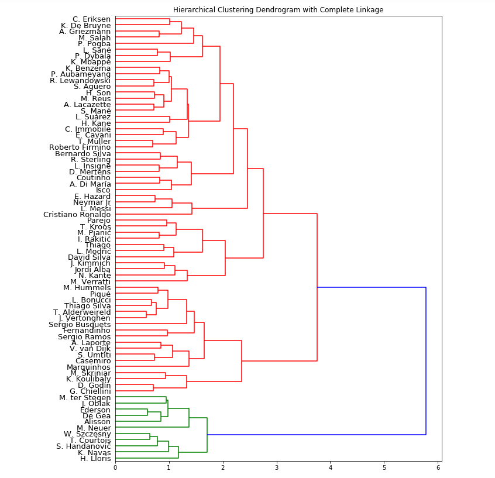

#### Dataset: https://www.kaggle.com/stefanoleone992/fifa-20-complete-player-dataset
